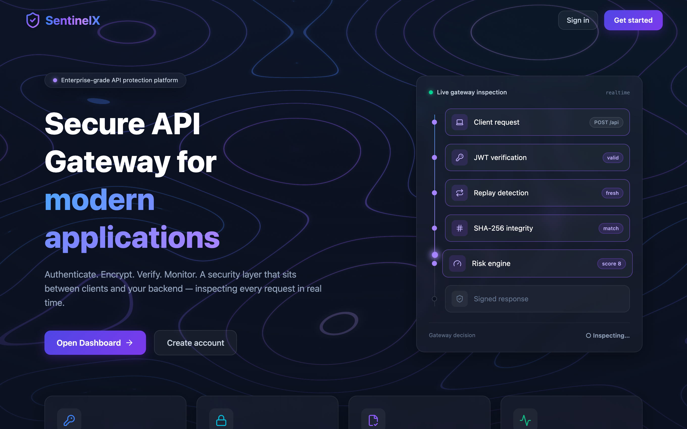
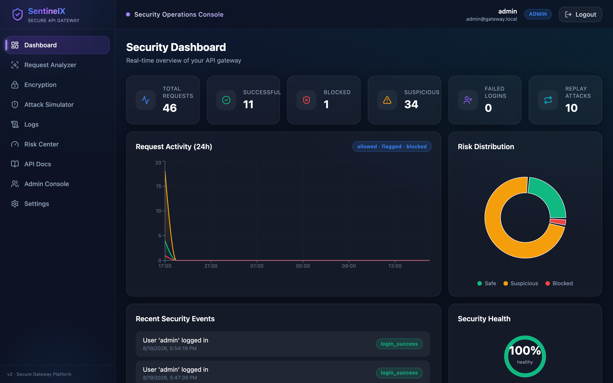
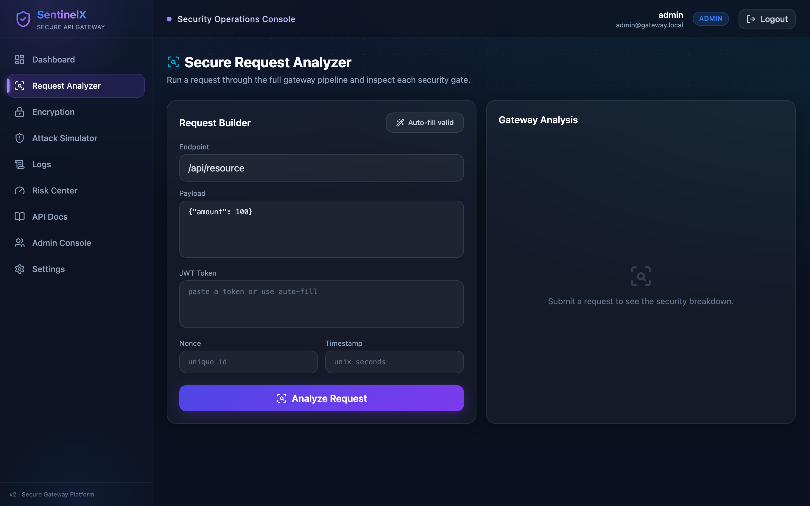
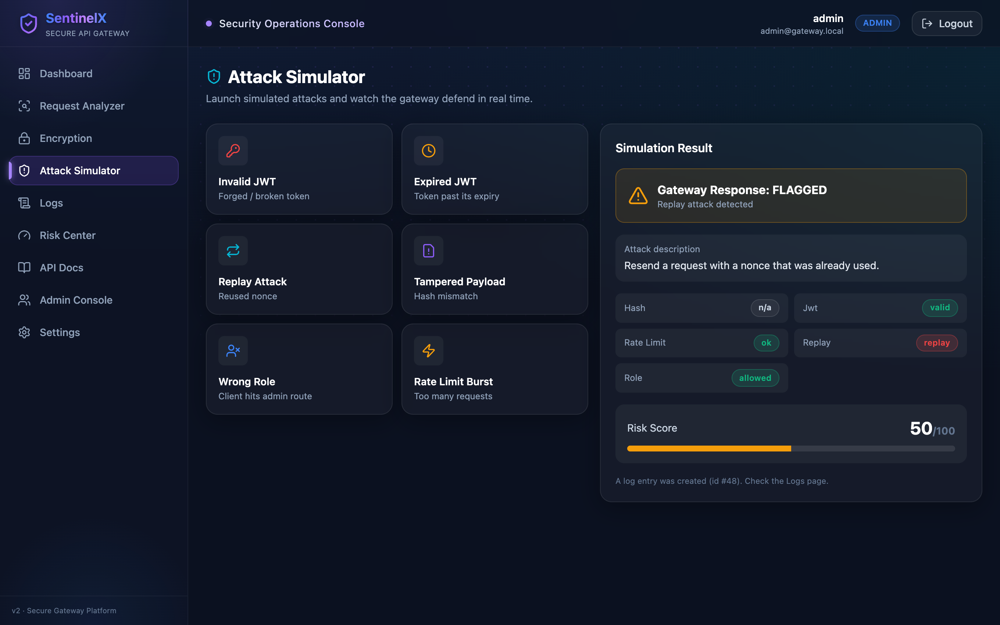
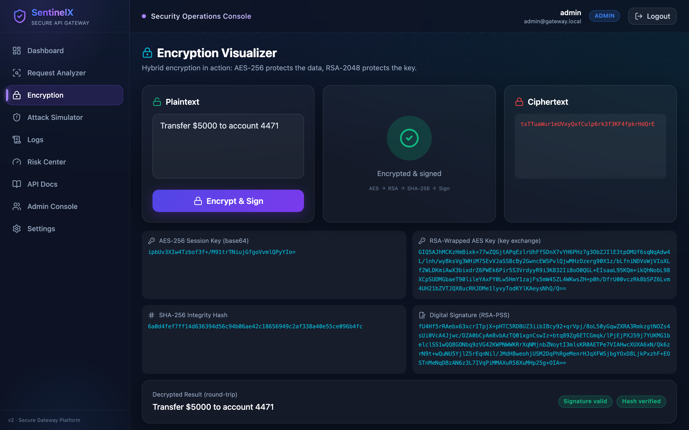
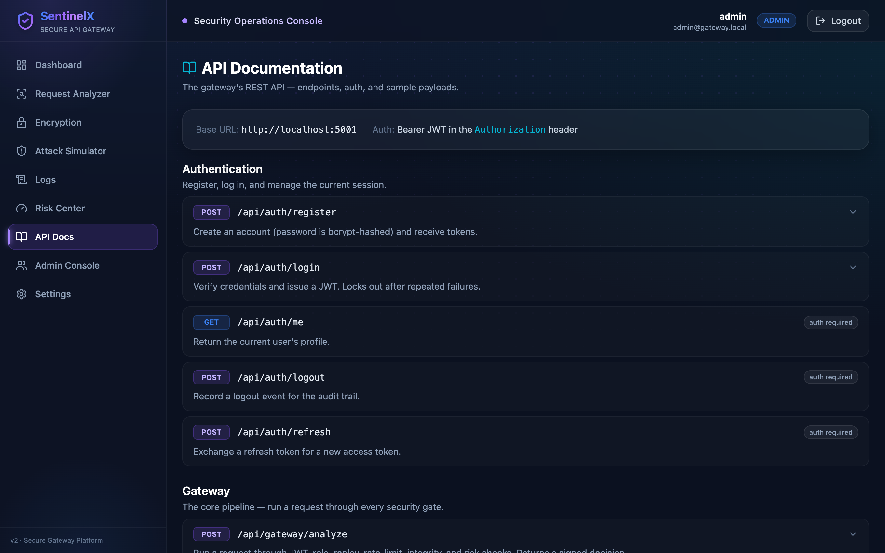
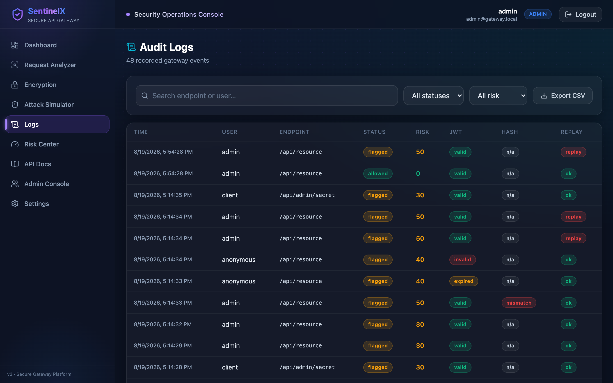

<div align="center">

# 🛡️ SentinelX — Secure API Gateway

### Authenticate · Encrypt · Verify · Monitor

A security layer that sits between clients and a backend and **inspects every API request in real time** — authenticating it, authorizing it, checking it for tampering and replay attacks, scoring its risk, and logging everything — wrapped in a premium **security-operations dashboard**.


</div>



---

## What is this?

Think of it as **airport security for APIs**. A request can't just walk into your backend — it passes through a line of checkpoints, and only clean requests get through:

| Airport | SentinelX gate |
|---|---|
| Show your passport | **JWT verification** — is this a real, logged-in user? |
| Boarding pass = seat 4B | **Role check (RBAC)** — are you allowed *here*? |
| Ticket already scanned? | **Replay detection** — is this a duplicated request? |
| Crowd rushing one gate | **Rate limiting** |
| Baggage X-ray | **SHA-256 integrity** — was the payload tampered with? |
| Sealed diplomatic pouch | **AES / RSA encryption** |
| Officer's judgment call | **Risk score** → allow / flag / block |
| CCTV records everything | **Audit logging** |

Every check is real, working logic — not a mockup. The dashboard makes the invisible security pipeline **visible**.

---

## ✨ Highlights

- 🔐 **Real cryptography** — AES-256 payload encryption, RSA-2048 key exchange, SHA-256 integrity, and RSA-PSS digital signatures on every response.
- 🎫 **JWT auth + RBAC** — bcrypt-hashed passwords, token expiry, brute-force lockout, admin vs. client roles.
- 🛰️ **Live gateway pipeline** — each request is scored 0–100 and labelled **safe / suspicious / blocked**, with a full breakdown of which gate failed and why.
- 🧪 **Attack Simulator** — one click launches invalid/expired JWT, replay, tampered-payload, wrong-role, and rate-limit attacks and shows the gateway defending.
- 📊 **Security operations dashboard** — summary cards, activity charts, risk distribution, a security-health score, and a searchable, exportable audit log.
- 📖 **Swagger-style API docs** built into the app.
- 🎨 **Premium UI** — dark glassmorphism, animated topographic background, and a live request-flow visualization (React + Vite + TypeScript + Tailwind + Framer Motion).

---

## 📸 Screenshots

|  |  |
|:--:|:--:|
| **Security Dashboard** | **Request Analyzer** |
|  |  |
| **Attack Simulator** | **Encryption Visualizer** |
|  |  |
| **API Documentation** | **Audit Logs** |
|  |  |

---

## 🔐 Security concepts demonstrated

| Concept | What it does | How it's implemented |
|---|---|---|
| **JWT authentication** | Stateless, signed identity tokens | Flask-JWT-Extended; role embedded as a claim; short expiry |
| **Password hashing** | Passwords never stored in plaintext | `bcrypt` (slow + salted) |
| **RBAC** | admin vs. client permissions | role claim + `@admin_required` middleware |
| **Hybrid encryption** | Fast + secure like TLS | AES-256-GCM for data, RSA-2048 (OAEP) to wrap the key |
| **Integrity** | Detect tampering | SHA-256 hash comparison |
| **Digital signatures** | Prove response authenticity | RSA-PSS over a SHA-256 digest |
| **Replay detection** | Reject duplicated requests | nonce + timestamp freshness window |
| **Rate limiting** | Stop flooding/abuse | in-memory sliding-window counter |
| **Risk scoring** | One decision from many signals | weighted factors → safe / suspicious / blocked |

---

## 🏗️ How a request flows

```
Client request
     │
 1. JWT verification      valid / invalid / expired / missing
 2. Role check (RBAC)     allowed / denied
 3. Replay detection      nonce + timestamp
 4. Rate limiting         sliding window
 5. SHA-256 integrity     match / mismatch (tamper)
 6. Risk scoring          0–100 → safe / suspicious / blocked
 7. Decision             allow / flag / reject
 8. Log everything        api_logs + risk_scores + events
 9. Signed response       RSA-PSS signature attached
```

---

## 🧰 Tech stack

**Frontend** — React 19 · Vite · TypeScript · Tailwind CSS · Framer Motion · Recharts · Lucide · React Router · Axios · React Hook Form

**Backend** — Python · Flask · Flask-JWT-Extended · Flask-SQLAlchemy · PyCryptodome · bcrypt

**Database** — SQLite for local dev → MySQL in production (swapped via SQLAlchemy, no code change)

---

## 🚀 Run it locally

**Prerequisites:** Python 3.11+ and Node.js 18+. No database to install — local dev uses SQLite. You'll use **two terminals**.

**Terminal 1 — backend**
```bash
cd backend
python3 -m venv venv
source venv/bin/activate          # Windows: venv\Scripts\activate
pip install -r requirements.txt
cp .env.example .env
python run.py                     # → http://localhost:5001
```

**Terminal 2 — frontend**
```bash
cd frontend
npm install
npm run dev                       # → http://localhost:5173
```

Open **http://localhost:5173** and sign in with a demo account:

| Role | Username | Password |
|---|---|---|
| Admin | `admin` | `admin123` |
| Client | `client` | `client123` |

> Port note: the backend uses **5001**, not 5000 — macOS reserves 5000 for AirPlay.

---

## 🔌 API surface (selected)

| Method | Endpoint | Purpose |
|---|---|---|
| `POST` | `/api/auth/register` · `/api/auth/login` | Auth + JWT issuance |
| `POST` | `/api/gateway/analyze` | Run a request through all security gates |
| `POST` | `/api/gateway/simulate` | Server-crafted attack scenarios |
| `POST` | `/api/crypto/demo` | Full AES + RSA + SHA-256 + signature demo |
| `GET`  | `/api/dashboard/summary` · `/timeline` · `/risk-distribution` | Analytics |
| `GET`  | `/api/logs` · `/api/logs/export` | Audit log + CSV export |
| `GET`/`POST` | `/api/admin/*` | User management, threats (admin only) |

The app also ships a full **Swagger-style API Docs** page.

---

## 📁 Project structure

```
secure_api_gateway_v2/
├── backend/                 # Flask API — the security "brain"
│   ├── app/
│   │   ├── models/          # SQLAlchemy tables (users, roles, api_logs, …)
│   │   ├── services/        # crypto, risk engine, replay, rate limiter, logging
│   │   ├── middleware/      # RBAC guards
│   │   └── routes/          # auth, gateway, crypto, dashboard, logs, admin, settings
│   └── run.py
├── frontend/                # React + Vite + TypeScript dashboard
│   └── src/
│       ├── pages/           # Landing, Login, Dashboard, Analyzer, Attack Sim, …
│       ├── components/      # reusable UI + animated backgrounds
│       ├── context/         # auth state
│       └── services/        # typed Axios API client
└── docs/                    # blueprint, screenshots
```

---

## 💬 Interview notes

A few questions this project is built to answer well:

- **Why bcrypt over SHA-256 for passwords?** bcrypt is deliberately slow + salted, defeating brute force; SHA-256 is fast and used here for *data integrity*, a different job.
- **Explain the hybrid encryption.** AES-256 encrypts the data (fast); the random AES key is wrapped with RSA-2048 (secure key exchange) — exactly how TLS works.
- **How do you stop replay attacks without Redis?** Each request carries a unique nonce + timestamp; the gateway rejects duplicate nonces and stale timestamps.
- **Why a gateway instead of putting this in the backend?** Centralization — one consistent checkpoint enforces auth, integrity, and limits for every endpoint.

---

<div align="center">

Built as a final-year Computer Science / IT project — modern UI, real security concepts, one cohesive product.

</div>
